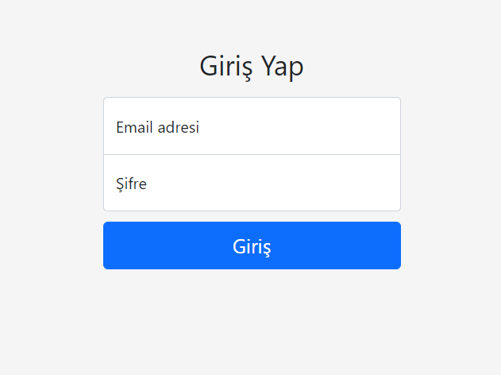
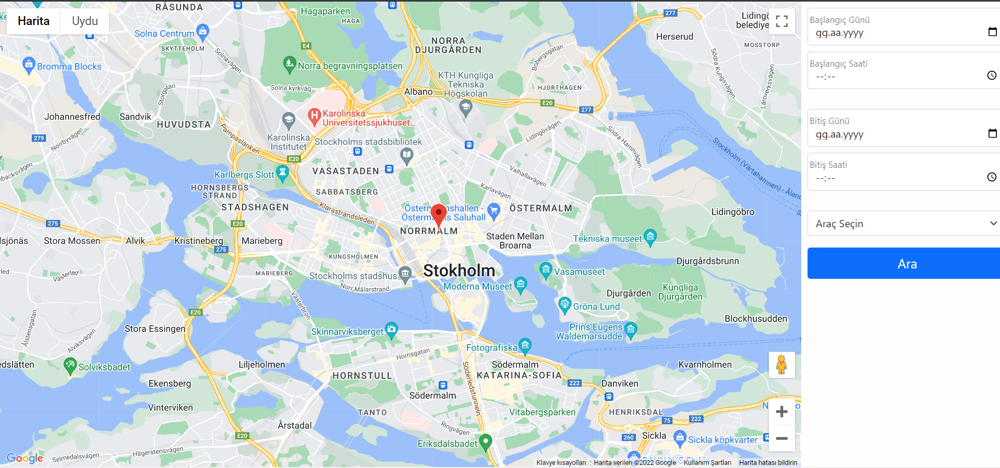

# Sweden Taxi WEB App (Ongoing)

**Table of Contents:**

1.  [What Is This App](#what-is-this-app)
2.  [Technologies Used](#technologies-used)
3.  [App Pictures](#app-pictures)

# What Is This App

This WEB App stores some taxi geolocation data from Sweden, and lets the user query for them within a given timeframe.

# Technologies Used

- NoSQL with MongoDB to store taxi data.
- SQLite to store user info.
- Node.js for backend.
- EJS for frontend.

# App Pictures

